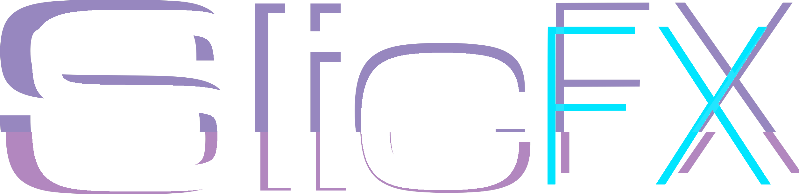

  

  <h1>Beta 1 Coming Soon!</h1>

<b>ETA: June 1st, 2026</b>

  
<b>A simplified all in one composition and visual effects suite for OBS Studio.</b>

---

# An Easy to Use OBS All In One Composition Suite

I got tired of complex nested scenes, mask files, and installing 10 different plugins just to make my stream look good.  I was spending more time tinkering with settings offline than I was streaming. So I built a unified, zero-friction composition suite.

SlicFX is a free plugin designed to bring easy-to-use premium aesthetics to your stream. No more fighting with the OBS engine, no more nested scenes to have a simple frosted glass look, no more making 4 chained filters to animate something around the screen.

SlicFX has all the effects you need bundled in one plugin. Drop a source or filter into your stream, and it just works.

---

<h2>SlicFX Sources</h2>

<i>(Add these via the main OBS <code>+</code> menu)</i>

<table>
<tr>
<td width="300" valign="middle">

<strong>🌫️ Slic Frosted Glass</strong>

</td>
<td>

The easiest way to get that blurred frosted glass background in OBS. It automatically applies a blur and texture to whatever is physically behind it. No more nested scene nightmares required. (Note: Slic Frosted Glass uses a Dual-Filtering / Kawase Blur method and can be reverse engineered. Not recommended for hiding sensitive data)

</td>
</tr>

<tr>
<td width="300" valign="middle">

<strong>🎛️ Slic Adjustment Layer</strong>

</td>
<td>

Drop this invisible, pass-through layer above your other sources, right-click it, and add any filter to it. This will apply the filter to anything that is behind this adjustment layer in real time, like in modern video editing software.

</td>
</tr>

<tr>
<td width="300" valign="middle">

<strong>👯 Slic Source Instance</strong>

</td>
<td>

A lightweight duplicate of any source. You can crop, filter, and transform this new instance independently without changing your original source, all while passing data directly through the GPU cache with virtually zero overhead.

</td>
</tr>
</table>

 

<h2>SlicFX Filters</h2>

<i>(Add these via the right-click "Filters" menu)</i>

<table>
<tr>
<td width="300" valign="middle">

<strong>🔲 Slic Rounded Corners</strong>

</td>
<td>

The absolute easiest way to get rounded coners on your webcam (or any other source) in OBS. Just drop this filter onto your source and drag the radius slider for perfect, procedural curved edges. Zero Photoshop mask files required.

</td>
</tr>

<tr>
<td width="300" valign="middle">

<strong>👤 Slic Background Removal</strong>

</td>
<td>

While NVIDIA Broadcast is still king, this filter can cleanly cut out your webcam without a green screen. It uses a highly optimized AI engine (Robust Video Matting) that is entirely hardware-agnostic, meaning you don't need an RTX card to get a flawless, real-time transparent cutout. (Stick with Broadcast if you have NVIDIA, haha)

</td>
</tr>

<tr>
<td width="300" valign="middle">

<strong>🟦 Slic Border</strong>

</td>
<td>

Automatically draws a drop shadow, solid line, or glowing edge directly around the edges of any source. If you pair this with a mask or background removal, the border will dynamically hug your body as you move around.

</td>
</tr>

<tr>
<td width="300" valign="middle">

<strong>🎬 Slic Animate</strong>

</td>
<td>

Applied directly to the source you want to animate/move (not the scene the source is in), add up to 10 steps in a single filter. This virtually eliminates the confusing, complex, and tedius filter chains.

</td>
</tr>

<tr>
<td width="300" valign="middle">

<strong>🧊 Slic 3D Transform</strong>

</td>
<td>

Push your flat 2D sources into 3D space. Easily adjust the pitch, yaw, and roll sliders to tilt your gameplay captures or webcams at cinematic, angled perspectives.

</td>
</tr>

<tr>
<td width="300" valign="middle">

<strong>💧 Slic Blur</strong>

</td>
<td>

A dedicated simple blur filter. (Note: Slic Blur uses a Dual-Filtering / Kawase Blur method and can be reverse engineered. Not recommended for hiding sensitive data)

</td>
</tr>

<tr>
<td width="300" valign="middle">

<strong>✂️ Slic Masks</strong>

</td>
<td>

This filter procedurally clips the alpha channel of your sources into perfect circles, diamonds, stars, etc using math instead of static image files.  However, if you like the tedius task of making your own mask files in photoshop, this can use those too!

</td>
</tr>
</table>

---

## Installation

<b>Click to expand Installation Steps</b>

 

1. Download the latest `SlicFX-Beta1-Windows.zip` from the Releases tab.

2. Extract the contents directly into your OBS directory. (Default location is `C:\Program Files\obs-studio`)

3. Launch OBS Studio.

4. You will find your new tools under the **Add Source** menu and the filters in your standard right-click **Filters** menu (look for the "Slic" prefix).

---

## The Roadmap & SlicBot

SlicFX Beta 1 is just the foundation. I am actively developing more premium visual tools, including:
### Planned Additions
* Slic Effect - A library of real-time filters (Heatwave, Glitch, VHS, Water, etc.) to give your stream a unique cinematic edge.

### Possible Additions
* Slic Displacement - Adding dynamic pixel-warping for custom glitch and refractive looks.
* Slic Custom Shader - A sandbox loader for power users to compile custom .hlsl code.
  

### SlicBot
SlicFX is designed from the ground up to be easy to use, but it will be even easier with **SlicBot** — an upcoming, web-based broadcast dashboard. While the SlicFX Plugin is and always will be free, SlicBot is designed to turn the free SlicFX Plugin into a full production studio.

###
* **Smart Auto-Layouts** - Playing a new game?  Choose trhe game name in your dash board and Slic bot will automatically move and resize your camera for optimum placement in a location that doesn't cover any of the game's UI elements.

* **Automated Animations** - Want your camera to do a barrel roll? Forget manual filter chains. Just save your camera source in the dashboard and click "Barrel Roll." SlicBot builds the filters, tweaks the settings, and executes the animation in real-time.

* **The Cost** - SlixFX Plugin is and always will be free, Slic Bot will also be free with a Twitch sub to my channel. It also will have a $3.99/mo option. SlicBot eliminates the "tinkering" phase, allowing you to focus on your stream while the bot manages your production values. SlicBot will make filters, change the settings, and execute them in realtime without the need for you to spend time tinkering with the settings of the always free SlicFX Plugin.

Stay tuned.

---

## Beta Feedback & Support
This is Beta 1, and every PC hardware setup is different.

If you encounter visual glitches, crashes, compatibility issues, or have feature requests, please open an issue in the repository. I am actively refining the C++ engine and want to make SlicFX the most stable and polished visual suite that I can.

---

## Credits & Licensing
_Developed by RyeMoes_

SlicFX is open-source software licensed under the **GPL-3.0 License**.

### 

* **Robust Video Matting (RVM):** Slic Background Removal is powered by the Robust Video Matting (RVM) model. [PeterL1n/RobustVideoMatting](https://github.com/PeterL1n/RobustVideoMatting) (Licensed under GPL-3.0).
